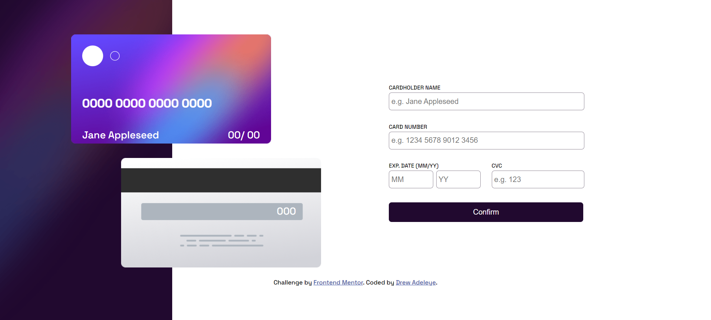
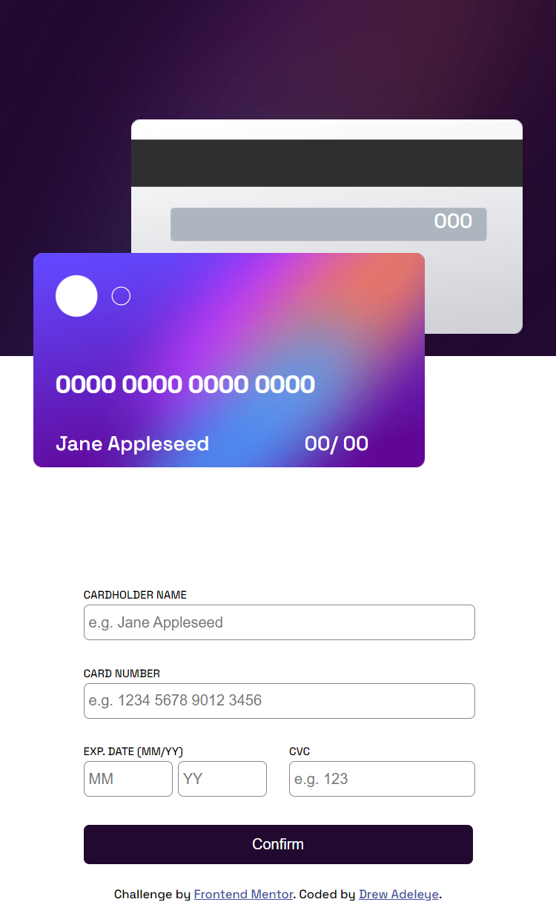

# Frontend Mentor - Interactive card details form solution

This is a solution to the [Interactive card details form challenge on Frontend Mentor](https://www.frontendmentor.io/challenges/interactive-card-details-form-XpS8cKZDWw). Frontend Mentor challenges help you improve your coding skills by building realistic projects. 

## Table of contents

  - [The challenge](#the-challenge)
  - [Screenshot](#screenshot)
  - [Links](#links)
  - [Built with](#built-with)
  - [What I learned](#what-i-learned)
- [Author](#author)

**Note: Delete this note and update the table of contents based on what sections you keep.**

### The challenge

Users should be able to:

- Fill in the form and see the card details update in real-time
- Receive error messages when the form is submitted if:
  - Any input field is empty
  - The card number, expiry date, or CVC fields are in the wrong format
- View the optimal layout depending on their device's screen size
- See hover, active, and focus states for interactive elements on the page

### Screenshot

### Links

- Solution URL: [Add solution URL here](https://your-solution-url.com)
- Live Site URL: [Add live site URL here](https://your-live-site-url.com)

### Built with

- Semantic HTML5 markup
- CSS custom properties
- Flexbox
- Vanilla JavaScript 

### What I learned

I have done 3 frontend mentor projects in the past and at the time of submission, this the most difficult project I have taken on. this project tested my html, css and Javascript skills. and also
took me the longest time to complete. I also had to do it two times because the first one was behaving funny, so I took the knowledge gained from the first time to remake it. This was a fun project to take on. 
I wasn't able to get it to work as i would have loved to but i'm still happy with what i have done.

I leart form validation
Regular expression
CSS Position property

## Author

- Frontend Mentor - [@Drew-adeleye](https://www.frontendmentor.io/profile/Drew-adeleye)
- Twitter - [@_Andrewiiii](https://www.twitter.com/_Andrewiiii)

