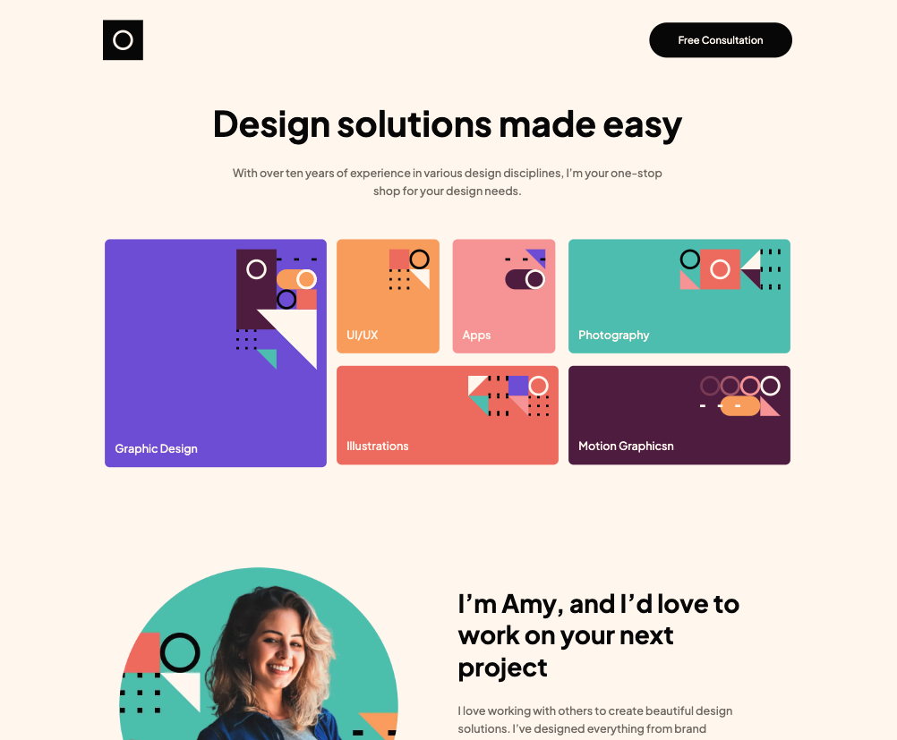
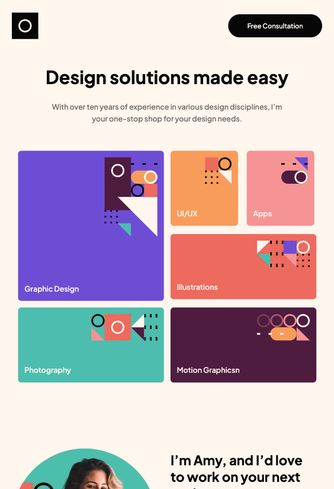
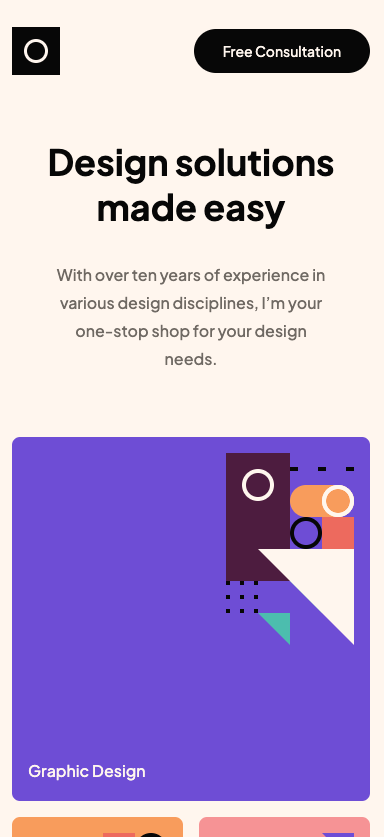

# Frontend Mentor - Single-page design portfolio solution

This is a solution to the [Single-page design portfolio challenge on Frontend Mentor](https://www.frontendmentor.io/challenges/singlepage-design-portfolio-2MMhyhfKVo). Frontend Mentor challenges help you improve your coding skills by building realistic projects.

## Table of contents

- [Overview](#overview)
  - [The challenge](#the-challenge)
  - [Screenshot](#screenshot)
  - [Links](#links)
- [My process](#my-process)
  - [Built with](#built-with)
  - [What I learned](#what-i-learned)
  - [Continued development](#continued-development)
  - [Useful resources](#useful-resources)
- [Author](#author)
- [Acknowledgments](#acknowledgments)

**Note: Delete this note and update the table of contents based on what sections you keep.**

## Overview

### The challenge

Users should be able to:

- View the optimal layout for the site depending on their device's screen size
- See hover states for all interactive elements on the page
- Navigate the slider using either their mouse/trackpad or keyboard

### Screenshot





### Links

- Solution URL: [mygithub](https://github.com/btebe/portfolio-single-page)
- Live Site URL: [vercel](https://portfolio-single-page.vercel.app/)

## My process

### Built with

- Semantic HTML5 markup
- CSS custom properties
- Flexbox
- CSS Grid
- [Next.js](https://nextjs.org/) - React framework

### What I learned

This project is similar to previous projects, in terms of layout challenge and responsivenss that i have done in Front-end-mentor. The only aspect that is reletively new is the scroll image slider. I did not import any new or specific libraries to acheive this. I just used react library useRef to access DOM elements and to control the scroll of a component.

To see how you can add code snippets, see below:

```js
const moveLeft = () => {
  const el = ref.current;
  setSlideLeft((el.scrollLeft -= 300));
  const elprev = ref.current.scrollLeft;
  if (elprev === 0) {
    if (hidebtnright === false) {
      setHidebtnright(true);
    }
  }
};
```

### Continued development

I want to further continue using next js in future projects and excel in it.

### Useful resources

- [Example resource 1](https://codepen.io/stiakov/pen/eYNpbyL) - This helped me understand the basic structure of a scroll image slider.
- [Example resource 2](https://codesandbox.io/s/hscroll-1oril?file=/src/cards.js) - This is helped mer understand the logic behind scroll image slider

## Author

- Website - [Basma Tebe](https://basma94tebe.wixsite.com/my-site)
- Frontend Mentor - [@btebe](https://www.frontendmentor.io/profile/btebe)

**Note: Delete this note and add/remove/edit lines above based on what links you'd like to share.**

## Acknowledgments

I would like to thank Santiago Torres for posting an example of scroll image slider on code pen. I also woudl like to thank Asim Hafeez for posting an example of scroll logic in react.
